# BULL&DEAR :boot:

## Introducción
 _Este documento describe el trabajo realizado en el proyecto final de FP de Desarrollo de Aplicaciones Web. El proyecto consiste en el desarrollo web de una tienda de zapatillas deportivas. El objetivo de dicha web es dar información sobre los zapatos, con sus correspondientes marcas, precio, descripción y enlace de compra._

#### _La web es accesible desde cualquier navegador por internet, escribiendo la siguiente dirección:_ [bullanddear.epizy.com](http://bullanddear.epizy.com)

#### _A la documentación se puede acceder desde la siguinte dirección:_ [bullanddear.epizy.com/documentacion](http://bullanddear.epizy.com/documentacion)
* Usuario: <b>admin</b>
* Contraseña <b>basic</b>

## DESPLIEGUE

_En el despliegue con máquinas virtuales he utilizado una máquina debiam como servidor y una máquina windows como cliente._
* Red: <b>10.0.2.8</b>
* Url ``www.bullanddear.virtual´´
* .ova máquina windowsXP - Cliente: [WINLigth_Cliente](https://drive.google.com/file/d/15bKtTnUn-4RqlVfnFACePceRoNfAUzdV)
* .ova máquina Debian8 - Servidor : [Debiaan8_Servidor](https://drive.google.com/file/d/14qUkGtYtFDZULMyfka-3m57-_O4ESzAx)

## Tecnologías utilizadas

|:wrench: |   Tecnológias  |:wrench: |
|---------|----------------|---------|
|:wrench: |     PHP 7     	|:wrench: |
|:wrench: |     HTML 5    	|:wrench: |
|:wrench: |     CSS 3     	|:wrench: |
|:wrench: |     MySQL     	|:wrench: |
|:wrench: |   phpMyAdmin  	|:wrench: |
|:wrench: |     ES6       	|:wrench: |
 

## Explicación del proyecto
 _En cuanto a los usuarios, la página tiene varios tipos. Por un lado, están los usuarios no registrados, que únicamente pueden consultar la lista de zapatillas, visualizarlas por categorías, acceder a la galería de imágenes y a una ruleta de marcas que podrá ser de gran ayuda para la elección a la hora de la compra. Por otro lado, están los usuarios registrados, que pueden acceder a una mayor funcionalidad dentro de la aplicación, como por ejemplo añadir zapatillas a la lista de deseos o añadir zapatillas a la cesta de la compra._ 

 _Aparte de esos dos tipos está el usuario administrador, es el que puede añadir, editar y borrar productos y categorías para que los clientes puedan visualizarlos. También lleva el control de usuarios, donde puede agregar, editar, borrar y restablecerle la contraseña a cualquier usuario._

### Funcionalidades: <b>Usuario no registrado</b>
 _Al entrar al enlace por primera vez, se mostrará una barra de navegación con dos cajas de texto en las que el usuario ha de introducir su nombre de usuario y su contraseña para loguearse con sus credenciales, en caso de no estar registrado, el usuario deberá hacerlo pinchando en el botón de registro, que una vez completado correctamente le volverá a redireccionar al inicio donde deberá escribir en las cajas de texto su nombre de usuario y contraseña elegida en el momento del registro para iniciar sesión con su cuenta._

  

_Tanto para los usuarios no registrados como para los registrados siempre aparecerá en la barra de tareas una galería y una ruleta que te ayudará a decidirte en caso de estar en duda sobre qué zapatillas elegir para la compra._

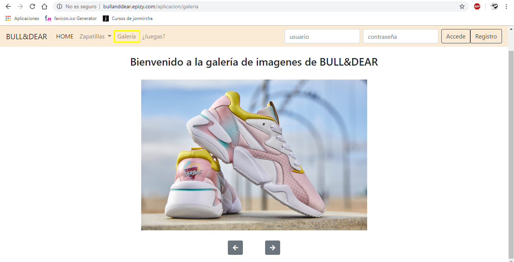 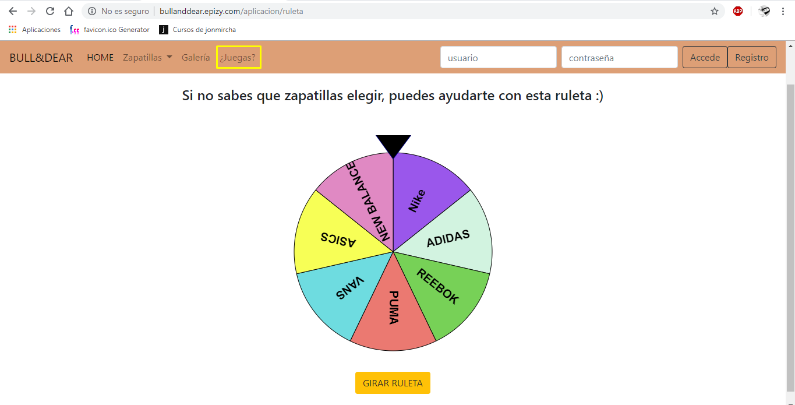 

### Funcionalidades: <b>Usuario registrado</b>

_Al entrar en su cuenta, el usuario verá el listado de productos igual que se veían antes de iniciar la sesión, junto con un botón en forma de corazón que al ser pulsado se añadirá el producto seleccionado a la lista de deseos y la página se redireccionará a la lista de deseos, junto a ese botón también aparecerá un botón de compra que al ser pulsado la página será redireccionada a la cesta de la compra donde se irán almacenando los productos que se deseen comprar, la cantidad, el precio de cada producto y el total._

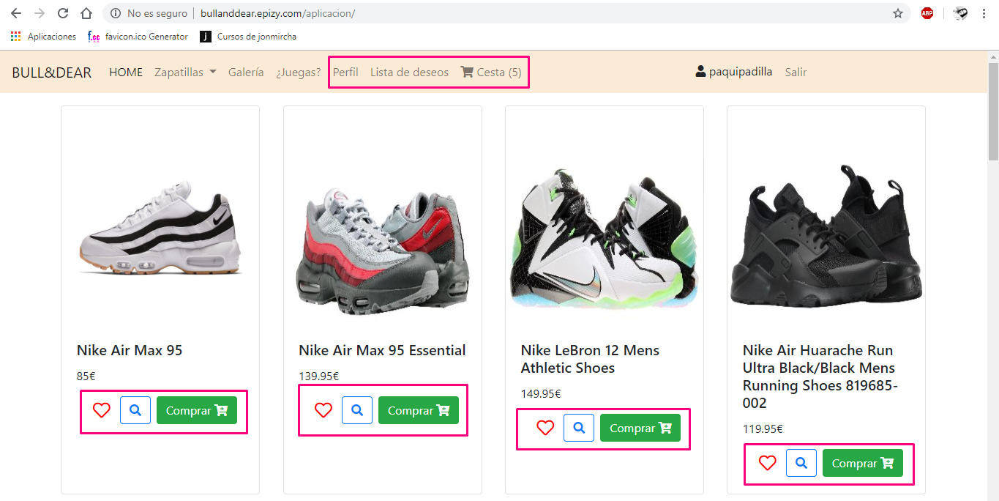

_El usuario registrado tendrá la opción de ver sus datos personales pinchando en <b>Perfil</b> desde la barra de navegación, podrá editarlo y cambiar su contraseña cuando le sea conveniente._

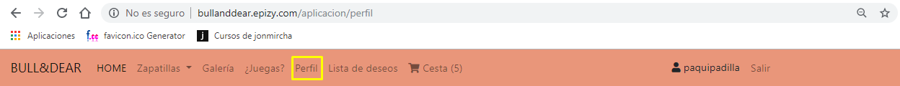  
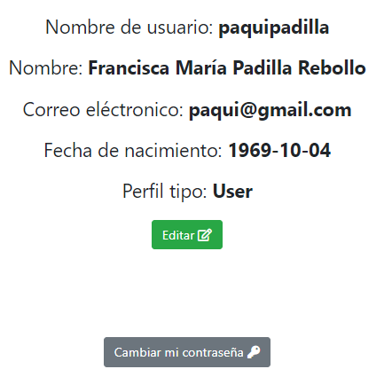 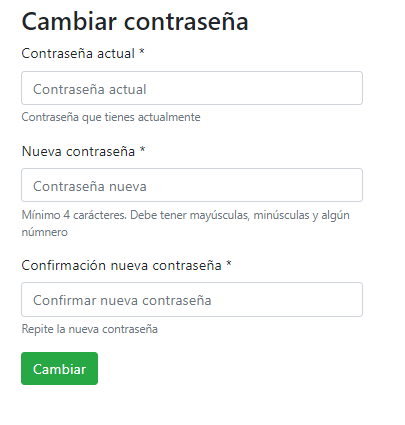

_Otra ventaja del usuario registrado es la lista de deseos, a la que se podrá acceder también desde la barra de navegación pinchando en <b>Lista de Deseos</b>, donde aparecerá una lista de los productos que se han ido añadiendo pulsando en el botón del corazón. Desde esa parte también se podrán añadir los productos a la cesta de la compra y borrarlos de la lista de deseos._

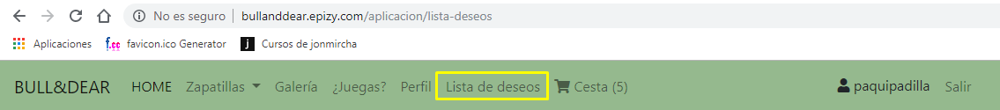 
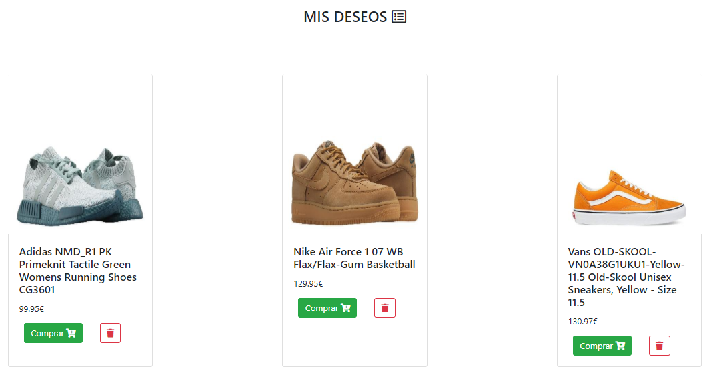

_El usuario registrado también podrá ver la lista de productos que ha ido añadiendo a la cesta, junto con la cantidad, el precio de cada producto y el total a pagar, a esto accederá pinchando en <b>Cesta</b> desde la barra de navegación._

 
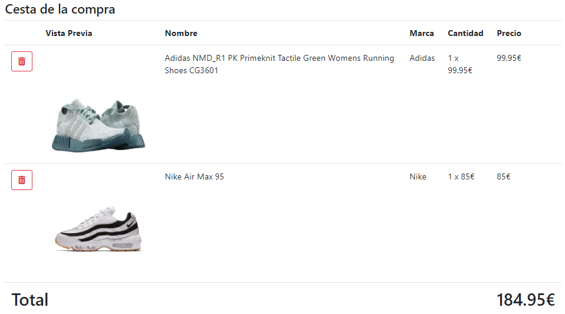

_Para salir y finalizar la sesión, el usuario únicamente tendrá que pinchar en el botón Salir, el último elemento de la barra de navegación junto al nombre de usuario._

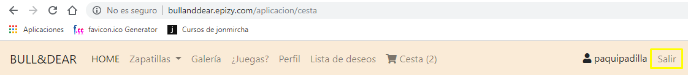

### Funcionalidades: <b>Usuario Administrador</b>

_El usuario administrador iniciará sesión igual que un usuario normal, una vez dentro del HOME aparecerá lo mismo que cuando no está la sesión iniciada. La barra de navegación será distinta a la de los usuarios normales._

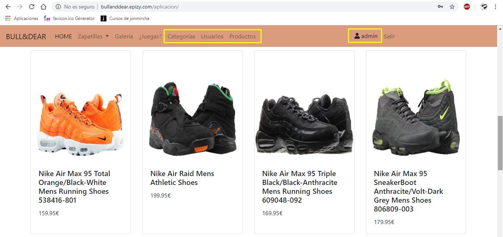

_El administrador podrá añadir, editar y eliminar categorías pinchando en <b>Categorías</b> desde la barra de navegación._

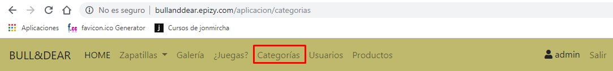 
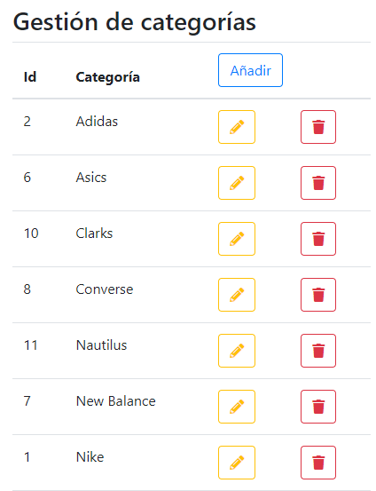

_De la misma manera pinchando en <b>Usuarios</b> desde la barra de navegación podrá añadir, editar y eliminar usuarios. También podrá cambiarle la contraseña a cualquier usuario en caso de olvido._

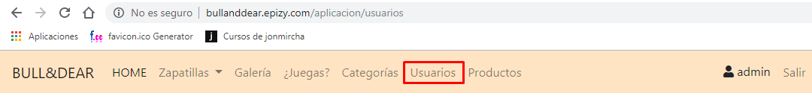 
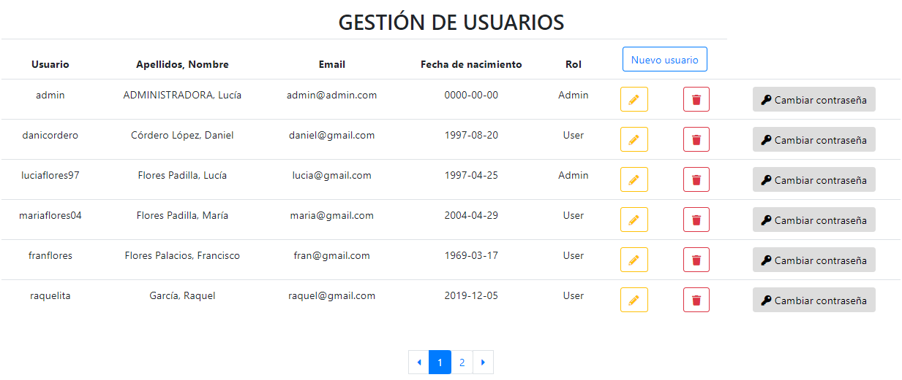 
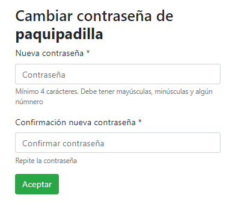

_Por último, podrá administrar los <b>productos</b> que se muestran en la pantalla principal, añadiendo nuevos, editando los que ya existen y eliminando el que desee._

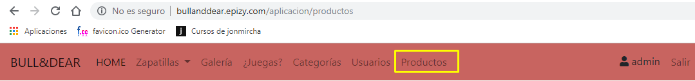 
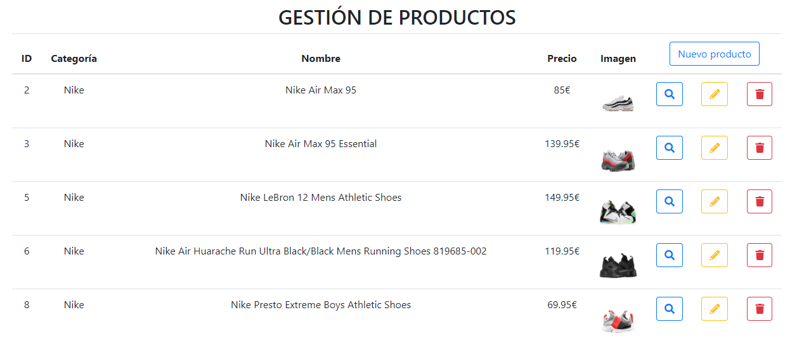

## Base de datos relacional

_La base de datos de bull&dear consta de cinco tablas: usuarios, productos, cesta, categorías y lista de deseos. Aquí os dejo un esquema para que observeis la relación entre cada tabla._

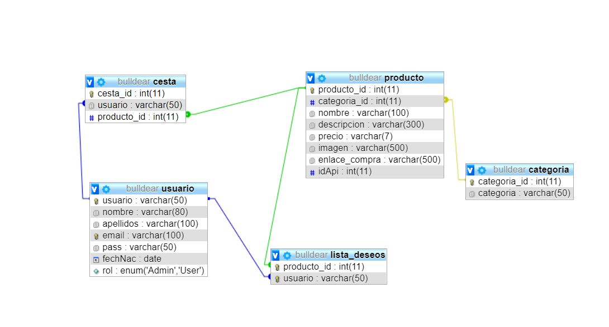 
