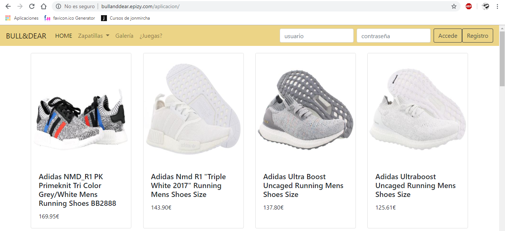
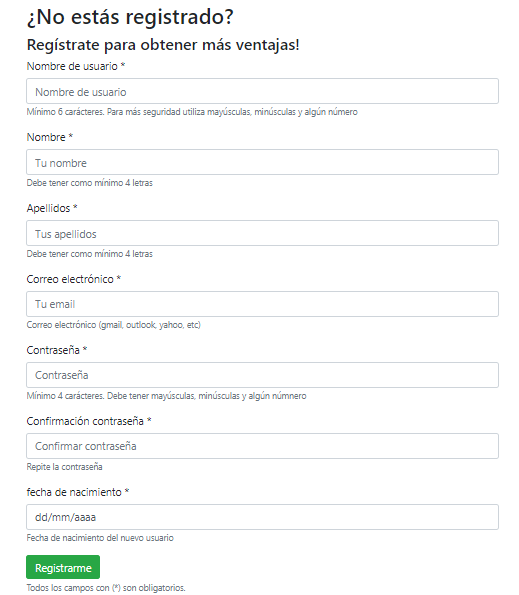

# BULL&DEAR :boot:

## Introducción
 _Este documento describe el trabajo realizado en el proyecto final de FP de Desarrollo de Aplicaciones Web. El proyecto consiste en el desarrollo web de una tienda de zapatillas deportivas. El objetivo de dicha web es dar información sobre los zapatos, con sus correspondientes marcas, precio, descripción y enlace de compra._

#### _La web es accesible desde cualquier navegador por internet, escribiendo la siguiente dirección:_ [bullanddear.epizy.com/aplicacion](http://bullanddear.epizy.com/documentacion)

## Tecnologías utilizadas
 _Escribir aquí las tecnologías utilizadas_
 
.Tabla con titulo

|===
|si queremos poner cada celda
|en una linea
|mejor indicarle en la cabecera cuantas columnas son

|si queremos poner cada celda
|en una linea
|mejor indicarle en la cabecera cuantas columnas son
|===

## Expicación del proyecto
 _En cuanto a los usuarios, la página tiene varios tipos. Por un lado, están los usuarios no registrados, que únicamente pueden consultar la lista de zapatillas, visualizarlas por categorías, acceder a la galería de imágenes y a una ruleta de marcas que podrá ser de gran ayuda para la elección a la hora de la compra. Por otro lado, están los usuarios registrados, que pueden acceder a una mayor funcionalidad dentro de la aplicación, como por ejemplo añadir zapatillas a la lista de deseos o añadir zapatillas a la cesta de la compra._ 

 _Aparte de esos dos tipos está el usuario administrador, es el que puede añadir, editar y borrar productos y categorías para que los clientes puedan visualizarlos. También lleva el control de usuarios, donde puede agregar, editar, borrar y restablecerle la contraseña a cualquier usuario._

### Funcionalidades: <b>Usuario no registrado</b>
 _Al entrar al enlace por primera vez, se mostrará una barra de navegación con dos cajas de texto en las que el usuario ha de introducir su nombre de usuario y su contraseña para loguearse con sus credenciales, en caso de no estar registrado, el usuario deberá hacerlo pinchando en el botón de registro, que una vez completado correctamente le volverá a redireccionar al inicio donde deberá escribir en las cajas de texto su nombre de usuario y contraseña elegida en el momento del registro para iniciar sesión con su cuenta._

  

